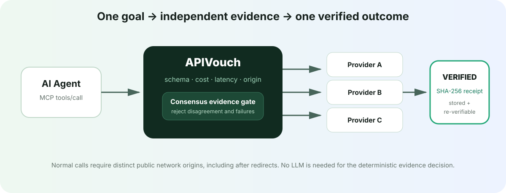
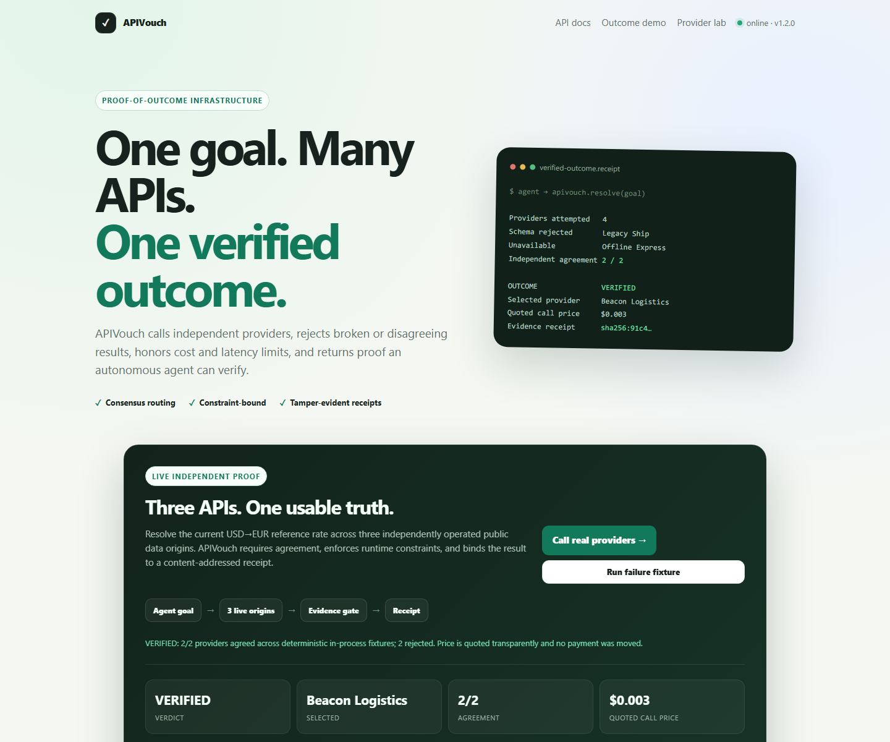

# APIVouch

**Route one agent goal across independent APIs, reject bad evidence, and return one verified outcome with a tamper-evident receipt.**

An autonomous agent should not trust the first API that answers. A provider can be unavailable, over budget, too slow, schema-invalid, or simply disagree with every independent source. APIVouch calls multiple public providers concurrently, enforces the caller's constraints, selects only from an agreeing evidence group, and binds the decision to the deployed source commit.



> Agents do not need another API directory. They need proof that the outcome they are about to use survived independent verification.

**Live deployment:** [https://apivouch.sklab.cc](https://apivouch.sklab.cc) ·
[health](https://apivouch.sklab.cc/health) ·
[deployment proof](https://apivouch.sklab.cc/.well-known/xagent-verification.json) ·
[OpenAPI docs](https://apivouch.sklab.cc/docs)

## The 30-second demo

Open [the deployed app](https://apivouch.sklab.cc) and click **Call real providers**. APIVouch resolves the current USD→EUR reference rate across Frankfurter, Floatrates, and ExchangeRate-API—three independently operated public origins. At least two must return schema-valid values within a 2% tolerance or the result is `UNVERIFIED`.

Then click **Run failure fixture**. Four deterministic, in-process provider fixtures compete to return the same delivery quote:

- two provider fixtures return agreeing numeric results;
- one returns the wrong type;
- one returns HTTP 503.

APIVouch rejects the bad evidence, selects the best eligible provider under cost and latency limits, stores the receipt, and verifies its SHA-256 integrity after reading it back. The failure flow is explicitly labelled as a deterministic self-contained fixture; the separate live flow calls three public origins, while normal API and MCP requests require distinct provider network origins, including after redirects. The demo is also honest about settlement: price is quoted, but no payment is moved yet.

The same capability is agent-callable through the product-level MCP endpoint at `POST /mcp` with tool `apivouch_resolve_verified_outcome`.



## What the capability completes

Given a public OpenAPI 3.x or Swagger 2.0 contract, APIVouch:

1. extracts operations and resolves local component references;
2. scores schema quality, documentation, consistency, errors, reliability, and agent usability;
3. performs bounded repeat observations of safe `GET`, `HEAD`, and `OPTIONS` operations;
4. validates JSON, content type, status, and declared response schemas;
5. detects response-shape drift across successful observations;
6. generates an evidence-labelled agent contract and re-analyzes it;
7. exports MCP tool definitions and serves them through a real JSON-RPC MCP endpoint.
8. proves exhaustive collection claims by traversing bounded pagination itself—never by trusting agent-supplied counts or cursors.

Across independent providers, APIVouch additionally:

1. accepts a goal, two to five public providers, extraction paths, response schemas, and price/latency constraints;
2. calls affordable providers concurrently through the same bounded SSRF-safe transport;
3. rejects HTTP errors, invalid JSON, missing result paths, schema mismatches, over-budget providers, and outliers;
4. requires configurable independent agreement, including numeric tolerance;
5. deterministically selects the strongest eligible provider and returns `VERIFIED` or refuses with `UNVERIFIED`;
6. stores a commit-bound receipt whose integrity can be recomputed without trusting APIVouch.

Receipts bind the redacted provider URL, a digest of the exact request URL, resolved origin, result path, expected-schema digest, full-response digest, extracted-value digest, bounded scalar preview, observed status/latency, selection policy, and deployment commit. `examples/verify_outcome_receipt.py` verifies the content address offline with Python's standard library. Optional Ed25519-signed v2 receipts additionally authenticate the issuer's key using the pinned `cryptography` dependency; see [signed receipts](docs/signed-receipts.md) for configuration, public-key discovery, offline verification, and trust limits.

Every score is deterministic. The before/after comparison is a re-analysis of two stored contracts—there is no hard-coded score boost and no LLM-generated evidence.

## Five-minute verification

```bash
git clone https://github.com/ShahadatTest/apivouch.git
cd apivouch
docker compose up --build
```

Open <http://localhost:8000> and choose **Run self-contained live demo**. The demo imports a deliberately incomplete contract, performs three calls per safe operation, detects two kinds of shape drift, generates an agent contract, and publishes dynamic tools at `/mcp/{project_id}`.

Run the test suite independently:

```bash
python -m pip install -r backend/requirements-dev.txt
python -m pytest -q
```

`backend/requirements.txt` contains production dependencies only;
`backend/requirements-dev.txt` adds the pinned test and lint toolchain.
CI blocks merges when either dependency set has a known vulnerability or an
invalid dependency resolution, and repeats the audit weekly.

The suite covers outcome routing, signing, readiness, independent HTTP verification,
and modern/legacy MCP. Run it for the current count rather than relying on a stale total.

Run the exact reviewer capability locally (deterministic and network-independent):

```bash
python scripts/verify_hackathon.py
```

Add `--live` to call three independent public exchange-rate providers. Both
paths store the receipt, re-verify it through MCP, and confirm that `/health`
and `/.well-known/xagent-verification.json` report the same source commit.

See [the hackathon submission draft](docs/hackathon-submission.md) for the
track positioning, safety declaration, monetization model, and final deployment
fields that must be filled only after release.

Production steps and commit-binding checks are in
[the deployment guide](docs/deployment.md). Security reports and deployment
boundaries are documented in [SECURITY.md](SECURITY.md).

## API surface

| Capability | Endpoint |
|---|---|
| Resolve a constrained, verified outcome | `POST /api/outcomes/execute` |
| Run the three-origin real-data demo | `POST /api/outcomes/live-demo` |
| Run the four-provider failure demo | `POST /api/outcomes/demo` |
| Retrieve and re-verify a receipt | `GET /api/outcomes/receipts/{id}` |
| Public human-readable receipt proof | `GET /receipts/{24-hex-id}` |
| List deterministic safety scenarios | `GET /api/outcomes/lab` |
| Run one deterministic safety scenario | `POST /api/outcomes/lab/{scenario_id}` |
| Product-level outcome MCP server | `POST /mcp` |
| Import a URL or inline contract | `POST /api/projects` |
| Upload JSON/YAML | `POST /api/projects/upload` |
| Static diagnostics | `POST /api/projects/{id}/analyze` |
| Bounded live evidence | `POST /api/projects/{id}/test` |
| Prove `ALL` / `NONE` / count / min / max | `POST /api/projects/{id}/prove` |
| Generate evidence-bound contract | `POST /api/projects/{id}/contract` |
| Download generated contract | `GET /api/projects/{id}/contract` |
| Invoke a safe generated operation | `POST /api/projects/{id}/proxy/{operation_id}` |
| Export the complete evidence pack | `GET /api/projects/{id}/export` |
| Dynamic MCP server | `POST /mcp/{id}` |
| Deployment health | `GET /health` |
| Bounded database/config/signing readiness | `GET /ready` |
| X-Agent deployment proof | `GET /.well-known/xagent-verification.json` |

Interactive OpenAPI documentation is available at `/docs`.

## Verified-outcome request

```json
{
  "goal": "Get a verified delivery quote",
  "providers": [
    {
      "name": "provider-a",
      "url": "https://provider-a.example/quote",
      "result_path": "quote.amount_usd",
      "expected_schema": {"type": "number", "minimum": 0},
      "price_usd": 0.004
    },
    {
      "name": "provider-b",
      "url": "https://provider-b.example/quote",
      "result_path": "quote.amount_usd",
      "expected_schema": {"type": "number", "minimum": 0},
      "price_usd": 0.003
    }
  ],
  "constraints": {
    "max_price_usd": 0.01,
    "max_latency_ms": 3000,
    "minimum_agreement": 2,
    "numeric_tolerance_percent": 1
  }
}
```

No provider is selected when the agreement requirement is not met. An `UNVERIFIED` response is a successful safety decision, not a fabricated best guess.

Every outcome demo shows a visible **View public proof →** link to `/receipts/<receipt_id>`. The public Receipt Explorer at `/receipts/{24-lowercase-hex-id}` fetches the authoritative `GET /api/outcomes/receipts/{id}` response and renders verdict, timestamps, goal, selection, agreement, quoted price (labelled not charged / no settlement), commit, format, fingerprint, separate integrity and authenticity states, signing key ID, and all provider attempts. Same-origin signature discovery proves consistency with this deployment, not independent truth of upstream data. No payment is executed.

The Chaos & Refusal Lab runs six deterministic in-process safety scenarios through the real verified-outcome path: `consensus-success` (VERIFIED), `provider-disagreement` (UNVERIFIED), `schema-invalid` (UNVERIFIED), `upstream-failure` (UNVERIFIED), `over-budget` (UNVERIFIED, zero provider calls), and `origin-convergence` (UNVERIFIED, final-origin rejection). `POST /api/outcomes/lab/{scenario_id}` accepts an exact zero-byte body; any declared or streamed body byte is rejected with HTTP 400 without buffering caller bytes. Each scenario uses a fixed fixture timestamp and fixed provider latency, so repeated runs yield identical canonical receipt JSON, receipt ID, fingerprint, and signature; the fixed timestamp is fixture evidence, never live freshness. Lab receipts are stored in an isolated table bounded by `MAX_LAB_RECEIPTS` that can never evict production evidence, and every stored receipt is proven canonical JSON round-trip exactly equal on retrieval. Scenario PASS means the receipt behaved as expected; receipt VERIFIED/UNVERIFIED is the outcome verdict. A correct UNVERIFIED refusal is a green PASS. Deterministic fixtures are not live-provider evidence.

Verify an exported receipt independently:

```bash
python examples/verify_outcome_receipt.py receipt.json
```

## Real MCP flow

Modern `2026-07-28` clients use stateless `server/discover`, `tools/list`, and
`tools/call` on both MCP endpoints, without initialization. See the
[modern MCP HTTP guide](docs/mcp-modern.md) for separate requests, exact metadata
and header requirements, error semantics, and the locally tested subset (not
official conformance).

Legacy clients can still initialize a generated project adapter:

```bash
curl -X POST https://YOUR_DEPLOYMENT/mcp/PROJECT_ID \
  -H "Content-Type: application/json" \
  -d '{
    "jsonrpc":"2.0",
    "id":1,
    "method":"initialize",
    "params":{
      "protocolVersion":"2025-06-18",
      "capabilities":{},
      "clientInfo":{"name":"reviewer","version":"1"}
    }
  }'
```

Then call `tools/list` or `tools/call`. A tool result includes a stable envelope:

```json
{
  "success": true,
  "data": {"temperature": 31},
  "error": null,
  "meta": {
    "operation_id": "get_weather",
    "upstream_status": 200,
    "contract_validated": true
  }
}
```

Every project with a `GET` operation also exposes `apivouch_prove_exhaustive_claim`. It rejects client-supplied evidence, starts at the first page, follows cursor/page/offset pagination within deployment caps, and checks page repetition, cursor progress, snapshot stability, and authoritative totals. Its verdict is `PROVEN`, `CONDITIONAL` (complete traversal without a declared snapshot), or `UNPROVEN`; a failed obligation can never receive a certificate. The latest result is stored with the project and included in its exported evidence pack.

## Safety and capability boundary

- Automatic testing and public tool execution are limited to read-only HTTP methods.
- Outcome routing accepts credential-free public `GET` providers only; URL query values are redacted from stored receipts.
- State-changing operations are documented but return `CONFIRMATION_REQUIRED`; they are never silently converted into `GET` requests.
- URL credentials, localhost, private, link-local, metadata, multicast, reserved, and unspecified IP ranges are blocked in production.
- Every redirect target is revalidated, response bodies are bounded, and request timeouts/retries are capped.
- Exhaustiveness proof collection defaults to at most 20 pages and 5,000 records; the server cap always wins over a caller's requested limit.
- Imported contracts, observations, and generated artifacts are stored in the configured database. API credentials are not accepted or stored.
- The tool diagnoses contract and runtime compatibility. It is not a vulnerability scanner, security auditor, compliance service, or guarantee that an upstream API is safe.

For local self-testing only, Docker Compose enables `ALLOW_PRIVATE_NETWORK=true`. The deployment blueprint keeps it disabled.

## Evidence model

Generated changes carry a `basis` such as:

- `deterministic` — derived only from contract structure;
- `conservative-default` — a machine-readable placeholder that is explicitly marked generated;
- `N bounded live observation(s)` — inferred only from stored successful JSON payloads;
- `adapter-envelope` — behavior enforced by APIVouch rather than claimed about the upstream.

APIVouch never claims that a generated description or inferred schema came from the API owner.

## Deployment

The primary self-hosted path is `deploy/vps/docker-compose.yml`: Caddy TLS,
non-root app, persistent PostgreSQL, internal-only DB networking, and separate
app internet egress. Root Compose is local development only. Render remains an
alternative. Follow the [Ubuntu operations guide](docs/deployment.md) for first
deploy, secrets, upgrade/rollback, backup/restore, and rotation. Set:

```text
PROJECT_SLUG=apivouch
GIT_COMMIT=<exact 40-character deployed commit>
PUBLIC_BASE_URL=https://YOUR_DEPLOYMENT
DATABASE_URL=<Render Postgres connection string>
ALLOW_PRIVATE_NETWORK=false
REQUIRE_SIGNED_RECEIPTS=true
RECEIPT_SIGNING_PRIVATE_KEY_B64=<inject through secret environment, never source>
```

The Render blueprint configures private Postgres in the same Singapore region.
Check current plan retention and availability. Render supplies `RENDER_GIT_COMMIT`
when `GIT_COMMIT` is unset; independently check that it equals the reviewed SHA.
The public VPS deployment is `https://apivouch.sklab.cc`; accept a release only
after `/health` and the deployment proof both report its exact reviewed commit.

Daily/manual verification uses repository variables `APIVOUCH_DEPLOYMENT_URL`
and `APIVOUCH_EXPECTED_COMMIT`. Missing values fail. Deterministic verification
is required; optional live exit 2 is not success. Sanitized reports expire after
seven days. Run `python scripts/scan_secrets.py` before publishing.

`/health` is liveness only. `/ready` returns 503 when the bounded database probe,
deployment configuration, or signing configuration fails. Public proof URLs come
only from a validated HTTPS `PUBLIC_BASE_URL`, never request headers; explicit
loopback HTTP is allowed for development. See the [independent deployment
verifier](docs/deployment-verifier.md) for the exact proof contract and disposable
real-Uvicorn verification command.

## Repository map

```text
backend/app/api/          REST, demo, and MCP transports
backend/app/services/     import, analysis, probing, contract, runtime
backend/tests/            unit and API/MCP integration tests
frontend/                 dependency-free responsive workbench
Dockerfile                single-service production image
render.yaml               stable deployment blueprint
```

## Known limits

- External `$ref` documents are not fetched; local JSON pointers are resolved.
- Authenticated endpoints are analyzed but cannot be live-tested by the public service.
- Pagination is auto-detected for common cursor, page, and offset conventions; unusual APIs can supply response paths and the request token parameter, but cannot supply observed evidence.
- Inferred schemas describe observed samples and are not asserted as the API owner's canonical contract.
- Local development defaults to SQLite; the public VPS deployment and production templates use PostgreSQL. The API lacks authentication and tenant isolation; do not store private customer evidence.
- SHA-256 proves integrity, not issuer authenticity. Ed25519 authenticates relative to a trusted public key; same-origin discovery is not independent identity attestation or proof of upstream truth.
- Fixtures and mocked tests do not demonstrate live availability. Modern MCP is a locally tested JSON subset, not officially certified; see [protocol limits](docs/mcp-modern.md).

## Monetization path

The atomic commercial capability is a **Verified Outcome**: concurrent provider evaluation, constraint enforcement, deterministic selection, and an integrity receipt. The current public build quotes provider prices but deliberately does not claim or simulate settlement. A production tier can add x402 payment after verification, retained evidence history, private providers, scheduled drift monitoring, and outcome SLAs.

License: MIT. See [LICENSE](LICENSE).
